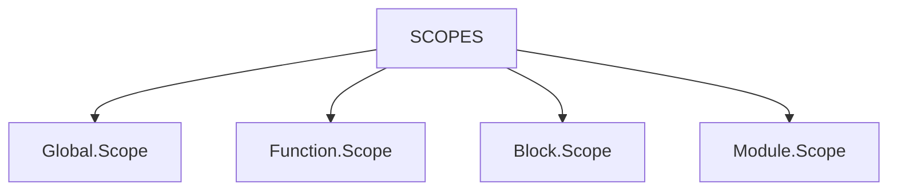
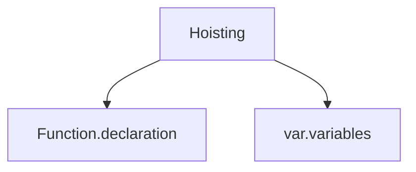

# <span style="color: Yellow;">__Scopes and hioisting__

## <span style="color: rgb(255,0,0);"> __What is Scope in JavaScript ?__</span>
```
In JavaScript, objects and functions are also variables. Scope determines the accessibility of variables, objects, and functions from different parts of the code.
```
>   We have 4 types of Scopes in JavaScript


```
 Global scope :
    The default scope for all code running in script mode.
```
```
 Function scope :
    The scope created with afunction.
```
```
 Block scope :
    This scope restricts the variable that is declared
inside a specific block, from access by the outside of the block.
```

## <span style="color: rgb(255,0,0);"> __What is Hoisting in JavaScript ?__ </span>
```
Hoisting is a JavaScript mechanism where variables and function declarations are moved to the top of their scope before code execution.
```

```
    In function declarion Hoisting works true.
    In variable var Hoisting works but answer will be undefined.
    In let and const variables Hoisting will be TDZ(Temporal Dead Zone).
    In function Arrow and Expressions Depends if using var or let / const.
```

> ## ***What is TDZ:***

